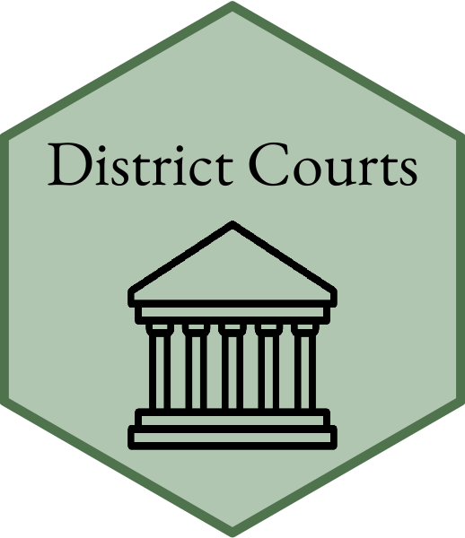
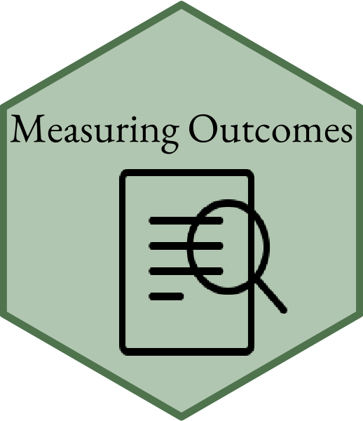

# About Me

I am an ABD Ph.D. student at the University of South Carolina in the Department of Political Science. I primarily study judicial politics and public policy. My research interests include operationalization and measurement of case outcomes at the U.S. Federal District Courts, litigant and attorney decision-making, and lower federal court judge decision-making as a response to attorney actions.

I enjoy studying judicial politics because it is one of the few areas that allows much flexibility in the kinds of research questions I pursue. Judges act not only as individuals, but also in groups and under institutional constraints and studying judicial politics allows me to explore both behavioral and institutional phenomena. My current projects center on the behavioral side of judicial decision-making, juxtaposing ideology as an influence on federal district judge decision making with the role attorneys play in influencing case processing, dispositions, and the decision to appeal and situating the theories within the specific and nuanced context of the district courts. If you would like to know more about my research, please see my website and latest CV.

### Interests:
  
